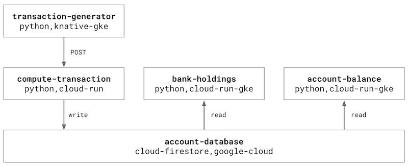

# Office Space using Cloud Run and Knative



This repo contains a set of sample microservices that can be used to demonstrate Cloud Run, Cloud Run on GKE, and Knative. The microservices comprise a faux "banking" application. 

The application allows you to generate a series of banking transactions – each time a transaction occurs, interest is computed and added to the original amount. The total amount is rounded down to the nearest penny and deposited into the banks holdings. The remaining fractional pennies are deposited into another account. 

Go watch [Superman III](https://www.imdb.com/title/tt0086393/) or [Office Space](https://www.imdb.com/title/tt0151804/) to learn more 🙃

See below for instructions on how to build and deploy the services.

## Project setup

- Install the [Google Cloud SDK](https://cloud.google.com/sdk)
- Create a [Google Cloud](https://console.cloud.google.com) project (with billing)
- Enable the following [APIs](https://console.cloud.google.com/apis/library):
  - Cloud Build
  - Container Registry
  - Cloud Run
  - Kubernetes Engine
  - Cloud Firestore

```
gcloud services enable \ 
  container.googleapis.com \
  containerregistry.googleapis.com \
  cloudbuild.googleapis.com \
  run.googleapis.com \
  firestore.googleapis.com
```

## Building container images

- Start by building the container images for each of the four microservices `account-balance`, `bank-holdings`, `compute-transaction`, and `transaction-generator`

```
for d in account-balance bank-holdings compute-transaction transaction-generator; \
  do gcloud builds submit $d/ \
    --tag gcr.io/[PROJECT]/$d-firestore \
    --project [PROJECT] \
    --async; done
```

## Infrastructure setup

- Use the following instructions to setup the deployment targets, specifically Cloud Run on GKE and Knative on GKE

### Cloud Run on GKE

- Create a GKE cluster with Cloud Run

```
gcloud beta container clusters create rungke \
  --addons=HorizontalPodAutoscaling,HttpLoadBalancing,Istio,CloudRun \
  --machine-type=n1-standard-4 \
  --cluster-version=latest --zone=[ZONE] \
  --enable-stackdriver-kubernetes \
  --enable-ip-alias \
  --scopes cloud-platform
```

- Grab the cluster credentials so you can run `kubectl` commands

`gcloud container clusters get-credentials rungke`

- Find the `istio-ingressgateway` external IP address

```
INGRESS=$(kubectl get svc -n istio-system istio-ingressgateway -o jsonpath={.status.loadBalancer.ingress..ip})
```

- Update the internal Knative domain configuration with the IP address from the previous step, using [xip.io](http://xip.io) as the dynamic DNS provider
- Note: this is for demo purposes only. For production deployments, refer to [Using a custom domain](https://cloud.google.com/run/docs/gke/default-domain#using_a_custom_domain) for Cloud Run on GKE

```
kubectl patch configmap config-domain --namespace knative-serving --patch \
  '{"data": {"example.com": null, "[INGRESS].xip.io": ""}}'
```

### Knative on GKE

- Create a GKE cluster with Istio

```
gcloud beta container clusters create knative \
  --addons=HorizontalPodAutoscaling,HttpLoadBalancing,Istio \
  --machine-type=n1-standard-4 \
  --cluster-version=latest --zone=[ZONE] \
  --enable-stackdriver-kubernetes \
  --enable-ip-alias \
  --scopes cloud-platform
```

- Grab the cluster credentials so you can `kubectl` commands to deploy and configure Knative

`gcloud container clusters get-credentials knative`

- Create a `cluster-admin` role binding so you can deploy and configure Knative

```
kubectl create clusterrolebinding cluster-admin-binding \
  --clusterrole=cluster-admin \
  --user=$(gcloud config get-value core/account)
```

- Install the Knative container resource definitions (CRDs)

```
kubectl apply --selector knative.dev/crd-install=true \
   -f https://github.com/knative/serving/releases/download/v0.8.0/serving.yaml \
   -f https://github.com/knative/eventing/releases/download/v0.8.0/release.yaml \
   -f https://github.com/knative/serving/releases/download/v0.8.0/monitoring.yaml
```

- Install the Knative `serving` and `eventing` components

```
kubectl apply \
  -f https://github.com/knative/serving/releases/download/v0.8.0/serving.yaml \
  -f https://github.com/knative/eventing/releases/download/v0.8.0/release.yaml \
  -f https://github.com/knative/serving/releases/download/v0.8.0/monitoring.yaml
```

- Find the `istio-ingressgateway` external IP address

```
INGRESS=$(kubectl get svc -n istio-system istio-ingressgateway -o jsonpath={.status.loadBalancer.ingress..ip})
```

- Update the internal Knative domain configuration with the IP address from the previous step, using [xip.io](http://xip.io) as the dynamic DNS provider
- Note: this is for demo purposes only. For production deployments, refer to [Setting up a custom domain](https://knative.dev/docs/serving/using-a-custom-domain/) for Knative on GKE

```
kubectl patch configmap config-domain --namespace knative-serving --patch \
  '{"data": {"example.com": null, "[INGRESS].xip.io": ""}}'
```

## Deploying

### Database

- Refer to the [Create a Cloud Firestore in Native mode database](https://cloud.google.com/firestore/docs/quickstart-servers#create_a_in_native_mode_database) instructions for setting up Cloud Firestore

### Services

**Compute Transactions**

```
gcloud beta run deploy compute-transaction --region [REGION] \
  --platform managed --allow-unauthenticated \
  --image gcr.io/[PROJECT]/compute-transaction-firestore:latest
```

- Be sure to note the URL of the `compute-transaction` service

**Transaction Generator**

- To deploy `transaction-generator`, confirm that `kubectl` is pointing to the `knative` GKE cluster
- Update the `COMPUTE_API` environement variable in [transaction-generator/service.yaml](transaction-generator/service.yaml) to the URL of the `compute-transaction` service 

`kubectl apply -f transaction-generator/service.yaml`


**Account Balance & Bank Holdings**

```
for service in account-balance bank-holdings; \
  do gcloud beta run deploy $service \
    --image gcr.io/[PROJECT]/$service-firestore:latest \
    --cluster rungke --cluster-location [ZONE] \
    --platform gke --connectivity external; \
    done
```

## Usage

- Run `kubectl get kservice transaction-generator`
- Navigate to `http://transaction-generator.default.[IPADDRESS].xip.io`
- Generate a series of transactions
- Use the following `gcloud` command to show the URLs for `account-balance` and `bank-holdings`

```
gcloud beta run services list \
  --platform gke --cluster rungke \
  --cluster-location [ZONE]
```

- Open `http://bank-holdings.default.[IPADDRESS].xip.io` to see how much money is in the bank
- Open `http://account-balance.default.[IPADDRESS].xip.io` to see how much money is in your personal account

## Cleanup

`gcloud container clusters delete rungke`

`gcloud container clusters delete knative`

```
gcloud beta run services delete compute-transaction \
  --region [REGION] --platform managed
```

